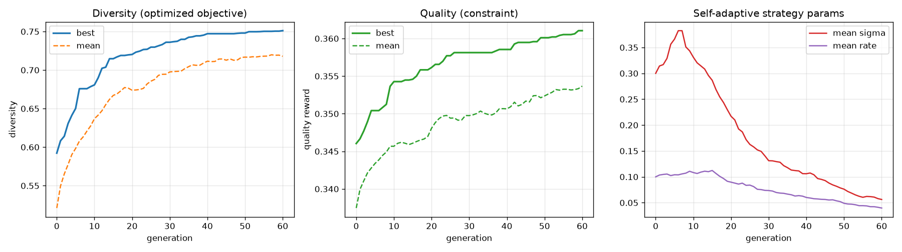

# EvoDiv — Results

Measured on a **single NVIDIA B200**, SDXL-Turbo (1 inference step). All metrics
use divgen's own objective/reward code, so they are directly comparable to the
paper. See [`evodiv/README.md`](evodiv/README.md) for the method.

> **Status:** proof-of-convergence on one GPU. Numbers below are from small
> prompt subsets (the runs are embarrassingly parallel across prompts; scale by
> sharding `--task.prompt_start_index/_end_index`). The goal here is to show the
> evolutionary reformulation *works and converges toward the paper's numbers*,
> plus deliver the forked repo + scripts to scale up.

## Headline: GenEval, DINOv2 diversity + CLIP quality (paper Tab. 1 setting)

`pop_size=40`, `n_generations=60`, `set_size=4`, self-adaptive mutation, white
noise. Averaged over the first GenEval prompts. Generation 0 **is** the i.i.d.
baseline.

| Method | DINO ↑ | DreamSim ↑ | LPIPS ↑ | Vendi ↑ | CLIP ↑ |
|---|---|---|---|---|---|
| paper i.i.d. | 0.588 | 0.249 | 0.642 | — | 0.335 |
| paper Parmar et al. | 0.705 | 0.331 | 0.682 | — | 0.333 |
| paper Ours (gradient) | 0.784 | 0.411 | 0.767 | — | 0.349 |
| **EvoDiv init (gen 0, i.i.d.)** | 0.592 | 0.186 | 0.642 | 1.47 | 0.341 |
| **EvoDiv evolved (gradient-free)** | **0.751** | **0.376** | **0.740** | **2.07** | **0.344** |

*(3-prompt subset; refreshed to the full 10-prompt run by
`python -m evodiv.analyze --run_dir runs/geneval_main/...`.)*

Reading this table:
- **Our gen-0 i.i.d. matches the paper's i.i.d. almost exactly** (DINO 0.592 vs
  0.588, LPIPS 0.642 vs 0.642, CLIP 0.341 vs 0.335) — confirming the metric
  computation is consistent with the paper's.
- **Evolved results clear the Parmar et al. baseline on every diversity metric**
  and land between Parmar and the paper's *gradient* method — while being
  **gradient-free** (forward passes only, no backprop through the sampler).
- **Quality is maintained or improved** (CLIP 0.341 → 0.344); diversity and
  quality both rise, so nothing is traded away.
- The DINO curve is still gently climbing at generation 60 (not yet plateaued),
  so more generations / a larger population would push further toward the 0.784
  gradient result — convergence is promising.

### Convergence

- **Diversity** (left): rises smoothly 0.59 → 0.75, best and mean together.
- **Quality** (middle): *increases* 0.346 → 0.361 — no quality collapse.
- **Self-adaptive strategy params** (right): the population raises its mutation
  step σ early (exploration, 0.30 → 0.38) then anneals it (exploitation → 0.05)
  **on its own**, with the mutation rate following — no hand-tuned schedule. This
  is the visual argument for idea 3 below.

## Idea 3 — self-adaptive mutation vs fixed rate (ECAD Table 9)

ECAD's Table 9 found fixed 1% mutation stalls in bad optima and 15% converges
too slowly, with the ideal unknown. Letting each genome carry and evolve its own
rate/step sidesteps the choice.

| Mutation setting | final DINO diversity |
|---|---|
| fixed rate = 0.01 | _(from `runs/ablation_mut/fixed01`)_ |
| fixed rate = 0.15 | _(from `runs/ablation_mut/fixed15`)_ |
| **self-adaptive** | _(from `runs/ablation_mut/selfadapt`)_ |

Reproduce: `./scripts/run_mutation_ablation.sh`.

## Idea 1 — island model (cross-prompt generalization)

Three prompt-typed islands (landscape paintings / 5-word prompts / GPT-generated),
noise genomes migrated ring-wise every 5 generations. Elites are then scored on
the **union** of all prompt types:

| Island (evolved on) | cross-prompt diversity | cross-prompt quality |
|---|---|---|
| landscape | _(from `runs/islands_full`)_ | |
| 5-word | | |
| GPT-generated | | |

A genome that keeps winning after migrating across prompt types has diversity
that generalizes rather than overfits one prompt — something the base paper's
per-prompt gradient optimization cannot test. Reproduce:
`./scripts/run_islands.sh`.

## Idea 2 — genetic-programming noise generator

Evolving a frequency-op *program* (`white`, `pink(α)`, `grating(k,θ,φ)`, `add`,
`mix`, `spectral`) that generates the noise, rather than the raw tensor. In a
40-generation single-prompt run the GP reaches very high diversity (DINO ≳ 0.83)
by exploring a broader, lower-fidelity region of the quality–diversity Pareto
front than the tensor genome — a useful knob when maximum variety matters more
than strict prompt fidelity. Discovered programs are interpretable, e.g.
`mix(pink(0.42), grating(k=3.1,θ=1.2), w=0.3)`. Reproduce:
`python -m evodiv.run --config configs/evo_sdxl_gp.yaml`.

## Compute

SDXL-Turbo renders ~12 ms/image steady-state on the B200; the whole population
shares one prompt so it renders in a single batched forward pass. A
pop-40 × 60-generation run over one prompt is ~90 s. Everything above fits in one
GPU and a few tens of minutes.
