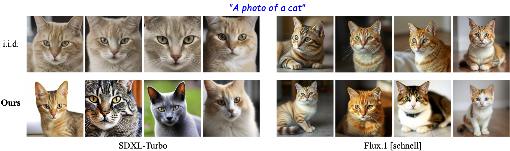
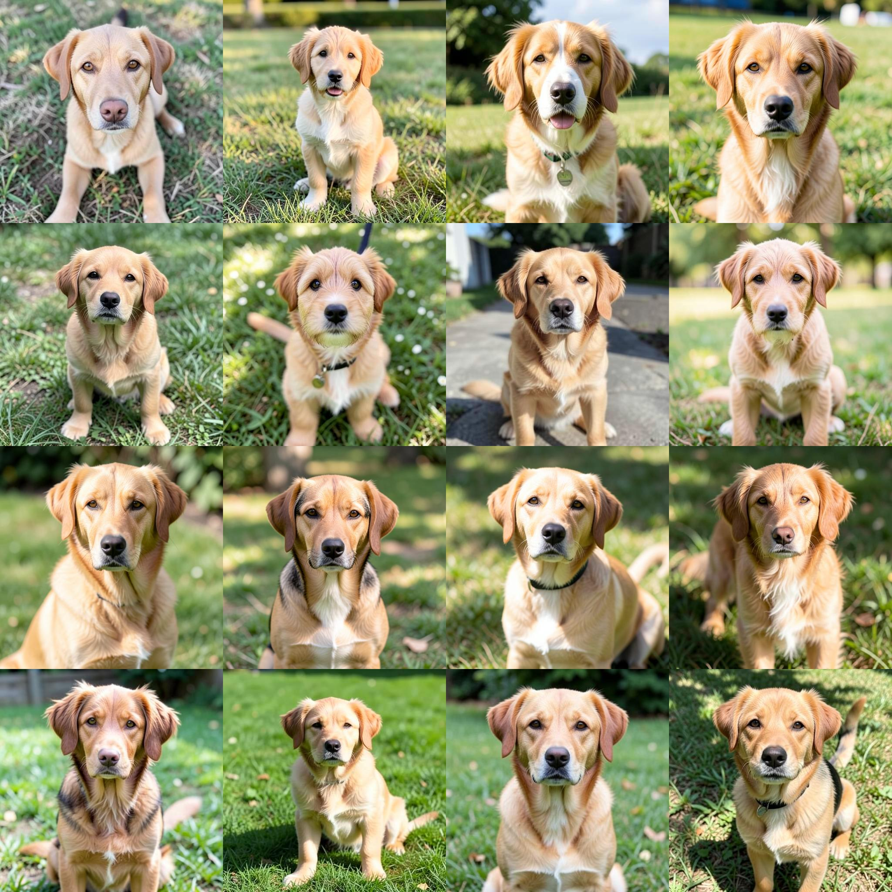
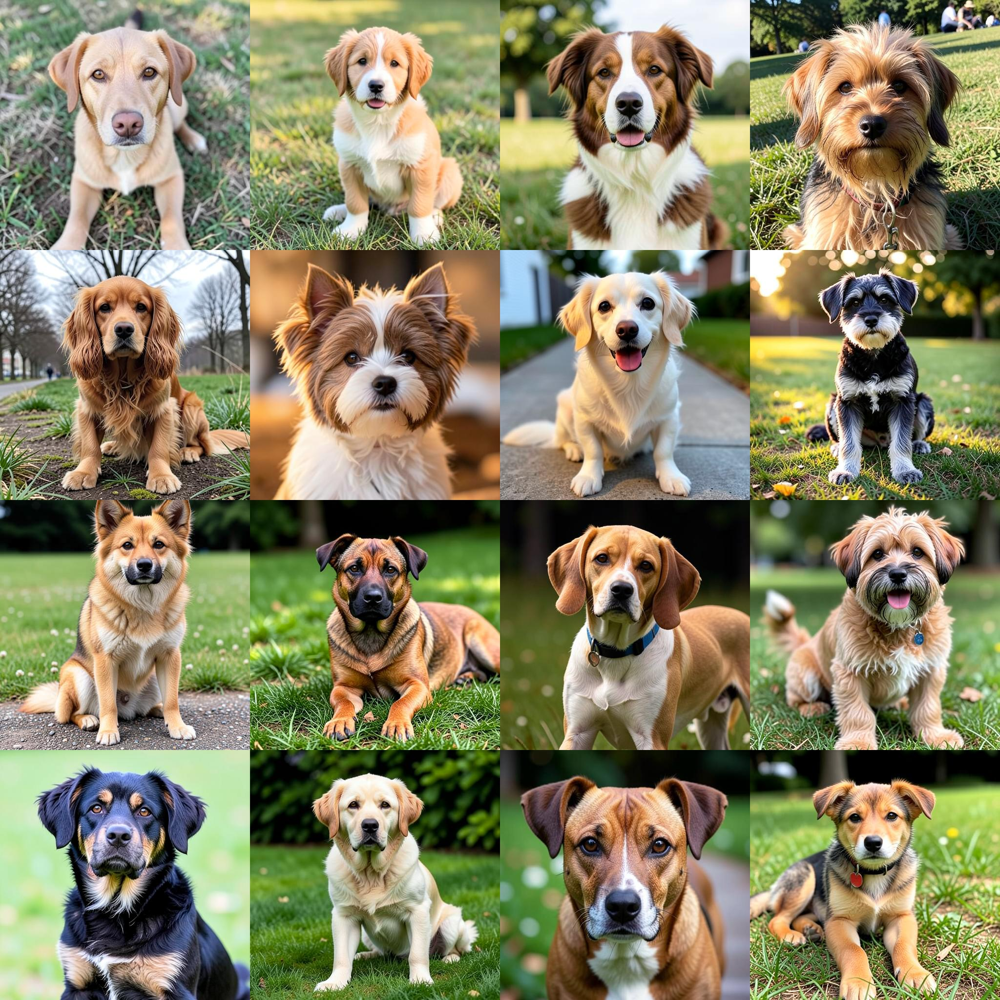

<h1 align="center">It's Never Too Late: Noise Optimization for Collapse Recovery in Trained Diffusion Models</h1>

<p align="center">
<a href="https://anneharrington.github.io/">Anne Harrington</a><sup>*</sup>, <a href="https://akoepke.github.io/">A. Sophia Koepke</a><sup>*</sup>, <a href="https://sgk98.github.io/">Shyamgopal Karthik</a>, <a href="https://people.eecs.berkeley.edu/~trevor/">Trevor Darrell</a>, <a href="https://people.eecs.berkeley.edu/~efros/">Alexei A. Efros</a>
</p>

<p align="center">
UC Berkeley · University of Tübingen, Tübingen AI Center · TU Munich, MCML
</p>

<p align="center">
<sup>*</sup>Equal contribution
</p>

<p align="center">
<b>CVPR, 2026</b>
</p>

<p align="center">

</p>

<p align="center">
<a href="https://akoepke.github.io/divgen/">Project Page</a> | <a href="https://arxiv.org/abs/2601.00090">arXiv</a>
</p>

---


> ### Fork addition: [EvoDiv - evolutionary noise optimization](evodiv/README.md)
> This fork reformulates the paper's gradient-based noise optimization as a **gradient-free
> multi-objective evolutionary search (NSGA-II)**, transplanting the [ECAD](https://research.aniaggarwal.com/ecad)
> genetic-algorithm framework. Quality vs. diversity becomes a Pareto front; no backprop through the
> diffusion model. See [`evodiv/README.md`](evodiv/README.md) and [`EVODIV_RESULTS.md`](EVODIV_RESULTS.md).


## Overview

We optimize the initial noise of pretrained diffusion models to recover from mode collapse, producing diverse images per prompt. We support batched optimization over a set of 4 images, and sequential generation that generates a diverse image set one sample at a time.


## Requirements

```bash
conda env create -f environment-divgen.yml
conda activate divgen
```

Supported models: SDXL-Turbo, PixArt-α, FLUX.1-schnell, FLUX.2-klein.
For gated models (FLUX), set `HF_TOKEN` in your environment.

Supported benchmarks: Datasets (`datasets/`) include GenEval (552 prompts), T2I-CompBench (8 subsets of 50 prompts each), and DPG-Bench (1065 prompts).

### Model cache

By default, all model weights (diffusion pipelines, HPSv2, ImageReward, CLIP,
DINO, DreamSim, SSCD, …) are downloaded to `./cache` relative to the current
working directory. The first run downloads several tens of GB; subsequent runs
reuse the cache.

To use a different location (e.g. shared scratch), point `paths.cache_dir` at
it — either by editing the YAML config, passing `--paths.cache_dir
/path/to/your/cache` on the command line, or symlinking with `ln -s
/path/to/your/cache ./cache`.

## Sequential generation

Generate 16 diverse samples sequentially for an input prompt, e.g. "A photo of a dog" or "A photo of a cat":

```bash
# FLUX.1-schnell (paper Fig. 3)
python -u main.py \
  --config configs/seq_flux_schnell.yaml \
  --task.prompt "A photo of a dog"

# FLUX.2-klein
python -u main.py \
  --config configs/seq_flux_klein.yaml \
  --task.prompt "A photo of a dog"
```

Example outputs (FLUX.2-klein, "A photo of a dog", 16 sequential samples):

<div align="center">
  <table>
    <tr>
      <td></td>
      <td></td>
    </tr>
  </table>
</div>
<p align="center"><em>Left: initial i.i.d. samples. Right: after sequential optimization.</em></p>

## Batched generation for a single prompt

To jointly optimize a batch of 4 latents for any prompt, we can use
`--task.type single --task.prompt ...`:

```bash
# SDXL-Turbo, white noise
python -u main.py \
  --config configs/geneval_sdxl_white.yaml \
  --task.type single --task.prompt "A photo of a chair"
```

Outputs land at `outputs/single/<settings>/<prompt>/` with `init_image.jpg`
(i.i.d. baseline) and `best_image.jpg` (post-optimization).

Example outputs (SDXL-Turbo, "A photo of a chair", batch of 4):

<div align="center">
  <table>
    <tr>
      <td></td>
      <td></td>
    </tr>
  </table>
</div>
<p align="center"><em>Left: initial i.i.d. samples. Right: after batched optimization.</em></p>

## Noise initialization (white vs. pink)

The initial latents can be drawn either as standard Gaussian (`white`) or as
spatially-correlated **pink** noise. Pink noise is generated by spectral
filtering of white noise: each frequency component at radial frequency
`f = sqrt(u^2 + v^2)` is reweighed by `1/(1+f)^alpha`, then the result is
renormalized to zero mean and unit variance per channel. The exponent
`alpha` controls how strongly low frequencies are emphasized:

Two CLI flags control this:

```bash
--optimization.noise_type {white,pink}  # default: white
--optimization.noise_exponent <float>   # alpha; default: 0.2 (only used when noise_type=pink)
```

For Flux models the noise is generated on the 2D latent grid first; for
FLUX.1-schnell it is then 2x2 spatial-to-channel packed so the spatial
correlations survive into the packed token sequence, and for FLUX.2-klein
the pipeline performs the packing internally on the already-correlated 4D
tensor. SDXL-Turbo and PixArt-α consume the 4D tensor directly.

Examples:

```bash
# SDXL-Turbo with pink noise, alpha = 0.2
python -u main.py \
  --config configs/geneval_sdxl_pink.yaml \
  --task.type single --task.prompt "A photo of a chair" \
  --optimization.noise_type pink --optimization.noise_exponent 0.2
```

Example outputs (SDXL-Turbo with pink noise, "A photo of a chair", batch of 4):

<div align="center">
  <table>
    <tr>
      <td></td>
      <td></td>
    </tr>
  </table>
</div>
<p align="center"><em>Left: initial i.i.d. pink samples. Right: after batched optimization.</em></p>

## Using different diversity objectives

We can use different diversity objectives: DINO/DreamSim/LPIPS/Color/L2/DPP/DPP-patch/Vendi.
Override the diversity / reward flags:

```bash
python -u main.py --config configs/config_div.yaml \
  --task.type geneval \
  --diversity.dpp.enable --diversity.dpp.weight 50 \
  --rewards.clip_b32.enable --rewards.clip_b32.weighting 10
```

Switch `--diversity.dpp.enable` for any of `--diversity.dino.enable`,
`--diversity.dreamsim.enable`, `--diversity.lpips.enable`,
`--diversity.color.enable`, `--diversity.tiny_l2.enable`,
`--diversity.dpp_patch.enable`, `--diversity.vendi.enable` (each with the
matching `--diversity.<name>.weight`).

## Reproducing benchmark results

All commands below run on a single GPU and process the whole benchmark
sequentially. To run faster, shard the prompt list across multiple GPUs
using `--task.prompt_start_index`/`--task.prompt_end_index`.

### GenEval generation with SDXL-Turbo and FLUX.1-schnell with DPP and HPSv2 objectives

```bash
python -u main.py --config configs/geneval_sdxl_white.yaml
python -u main.py --config configs/geneval_sdxl_pink.yaml
python -u main.py --config configs/geneval_flux_white.yaml
python -u main.py --config configs/geneval_flux_pink.yaml
```

### DPG-Bench with FLUX.1-schnell

```bash
python -u main.py --config configs/dpg_flux_white.yaml
```

### Merging results

When you run a benchmark (e.g. across multiple GPUs)
each prompt will have their results `00000/results.json`, `00001/results.json`, ... under
`outputs/<task>/<settings>/`. To aggregate the results into the numbers reported in the paper:

```bash
# Merge all per-prompt JSONs into a merged_results.json file and print results,
python div_utils/merge_results.py outputs/<task>/<settings>/
```

## Outputs

```
outputs/<task>/<settings>/
  ├── 00000/samples/             # batched: per-prompt init and optimized images
  ├── best_image.jpg             # sequential: combined grid of optimized samples
  ├── init_image.jpg             # sequential: combined grid of i.i.d. samples
  └── sequential_results.json    # sequential: per-sample metrics
```

The `settings` directory name encodes model, seed, lr, grad_clip, n_iters,
num_samples, enabled rewards/diversity weights, and (for pink) the noise
exponent.

## Reproducibility

Results between runs may differ slightly even when random seeds are fixed.
This is a known property of the underlying CUDA / PyTorch / diffusers stack
also reported in
[Issue #13 in the ReNO repo](https://github.com/ExplainableML/ReNO/issues/13). Our setup has the same property.

## Citation

If you find this code useful, please cite:

```bibtex
@inproceedings{harrington2026divgen,
  title     = {It's Never Too Late: Noise Optimization for Collapse Recovery in Trained Diffusion Models},
  author    = {Harrington, Anne and Koepke, A. Sophia and Karthik, Shyamgopal and Darrell, Trevor and Efros, Alexei A.},
  booktitle = {CVPR},
  year      = {2026},
}
```
